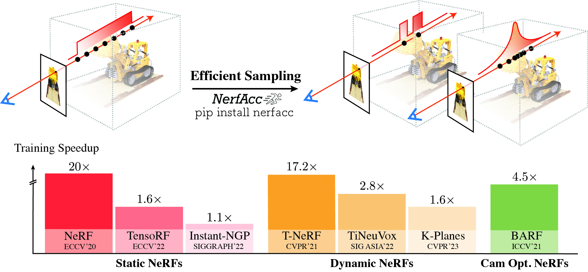

NerfAcc Documentation
===================================

NerfAcc is a PyTorch Nerf acceleration toolbox for both training and inference. It focus on
efficient sampling in the volumetric rendering pipeline of radiance fields, which is 
universal and plug-and-play for most of the NeRFs.
With minimal modifications to the existing codebases, Nerfacc provides significant speedups 
in training various recent NeRF papers.
**And it is pure Python interface with flexible APIs!**

|

|

| Github: https://github.com/KAIR-BAIR/nerfacc
| Paper: https://arxiv.org/pdf/2305.04966.pdf
| Authors: `Ruilong Li`_, `Hang Gao`_, `Matthew Tancik`_, `Angjoo Kanazawa`_

.. note::

   Though this repo only contains examples for single scene optimization,
   we believe generalizable NeRFs across multiple scenes can also be accelerate with our 
   :class:`nerfacc.PropNetEstimator`. Examples will be added soon.

Installation:
-------------

**Dependence**: Please install `Pytorch`_ first.

The easist way is to install from PyPI. In this way it will build the CUDA code **on the first run** (JIT).

.. code-block:: console
   
   $ pip install nerfacc

Or install from source. In this way it will build the CUDA code during installation.

.. code-block:: console

   $ pip install git+https://github.com/KAIR-BAIR/nerfacc.git

We also provide pre-built wheels covering major combinations of Pytorch + CUDA versions. 
See our `Github README`_ for what we support.

.. code-block:: console
   
   // e.g. torch 1.13.0 + CUDA 11.7
   $ pip install nerfacc -f https://nerfacc-bucket.s3.us-west-2.amazonaws.com/whl/torch-1.13.0_cu117.html

Usage:
-------------

The idea of NerfAcc is to perform efficient volumetric sampling with a computationally cheap estimator to discover surfaces.
So NerfAcc can work with any user-defined radiance field. To plug the NerfAcc rendering pipeline into your code and enjoy 
the acceleration, you only need to define two functions with your radience field.

- `sigma_fn`: Compute density at each sample. It will be used by the estimator
  (e.g., :class:`nerfacc.OccGridEstimator`, :class:`nerfacc.PropNetEstimator`) to discover surfaces. 
- `rgb_sigma_fn`: Compute color and density at each sample. It will be used by 
  :func:`nerfacc.rendering` to conduct differentiable volumetric rendering. This function 
  will receive gradients to update your radiance field.

An simple example is like this:

.. code-block:: python

   import torch
   from torch import Tensor
   import nerfacc 

   radiance_field = ...  # network: a NeRF model
   rays_o: Tensor = ...  # ray origins. (n_rays, 3)
   rays_d: Tensor = ...  # ray normalized directions. (n_rays, 3)
   optimizer = ...  # optimizer

   estimator = nerfacc.OccGridEstimator(...)

   def sigma_fn(
      t_starts: Tensor, t_ends:Tensor, ray_indices: Tensor
   ) -> Tensor:
      """ Define how to query density for the estimator."""
      t_origins = rays_o[ray_indices]  # (n_samples, 3)
      t_dirs = rays_d[ray_indices]  # (n_samples, 3)
      positions = t_origins + t_dirs * (t_starts + t_ends)[:, None] / 2.0
      sigmas = radiance_field.query_density(positions) 
      return sigmas  # (n_samples,)

   def rgb_sigma_fn(
      t_starts: Tensor, t_ends: Tensor, ray_indices: Tensor
   ) -> Tuple[Tensor, Tensor]:
      """ Query rgb and density values from a user-defined radiance field. """
      t_origins = rays_o[ray_indices]  # (n_samples, 3)
      t_dirs = rays_d[ray_indices]  # (n_samples, 3)
      positions = t_origins + t_dirs * (t_starts + t_ends)[:, None] / 2.0
      rgbs, sigmas = radiance_field(positions, condition=t_dirs)  
      return rgbs, sigmas  # (n_samples, 3), (n_samples,)

   # Efficient Raymarching:
   # ray_indices: (n_samples,). t_starts: (n_samples,). t_ends: (n_samples,).
   ray_indices, t_starts, t_ends = estimator.sampling(
      rays_o, rays_d, sigma_fn=sigma_fn, near_plane=0.2, far_plane=1.0, 
      early_stop_eps=1e-4, alpha_thre=1e-2, 
   )

   # Differentiable Volumetric Rendering.
   # colors: (n_rays, 3). opaicity: (n_rays, 1). depth: (n_rays, 1).
   color, opacity, depth, extras = nerfacc.rendering(
      t_starts, t_ends, ray_indices, n_rays=rays_o.shape[0], rgb_sigma_fn=rgb_sigma_fn
   )

   # Optimize: Both the network and rays will receive gradients
   optimizer.zero_grad()
   loss = F.mse_loss(color, color_gt)
   loss.backward()
   optimizer.step()

Links:
-------------

.. toctree::
   :glob:
   :maxdepth: 1
   :caption: Methodology

   methodology/*

.. toctree::
   :glob:
   :maxdepth: 1
   :caption: Python API

   apis/*

.. toctree::
   :glob:
   :maxdepth: 1
   :caption: Example Usages and Benchmarks

   examples/*

.. toctree::
   :maxdepth: 1
   :caption: Projects

   nerfstudio <https://docs.nerf.studio/>
   sdfstudio <https://autonomousvision.github.io/sdfstudio/>
   instant-nsr-pl <https://github.com/bennyguo/instant-nsr-pl>

.. _`vanilla Nerf`: https://arxiv.org/abs/2003.08934
.. _`Instant-NGP Nerf`: https://arxiv.org/abs/2201.05989
.. _`D-Nerf`: https://arxiv.org/abs/2011.13961
.. _`MipNerf360`: https://arxiv.org/abs/2111.12077
.. _`pixel-Nerf`: https://arxiv.org/abs/2012.02190
.. _`Nerf++`: https://arxiv.org/abs/2010.07492

.. _`Ruilong Li`: https://www.liruilong.cn/
.. _`Hang Gao`: https://hangg7.com/
.. _`Matthew Tancik`: https://www.matthewtancik.com/
.. _`Angjoo Kanazawa`: https://people.eecs.berkeley.edu/~kanazawa/

.. _`Github README`: https://github.com/KAIR-BAIR/nerfacc#readme

.. _`PyTorch`: https://pytorch.org/get-started/locally/
